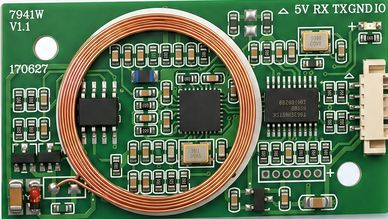
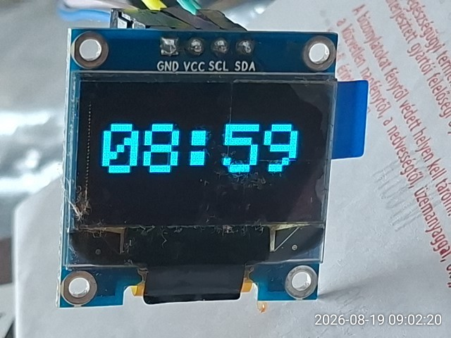
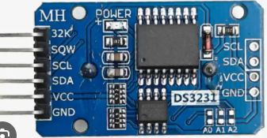
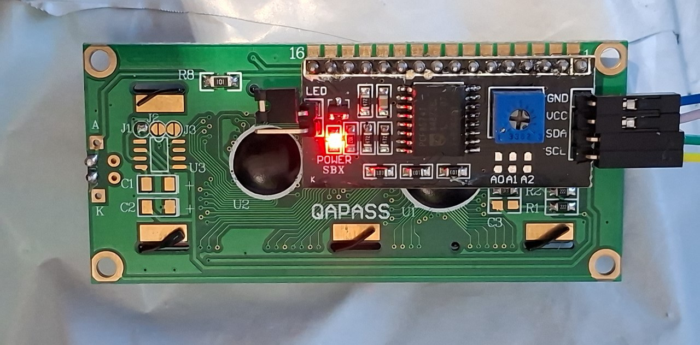
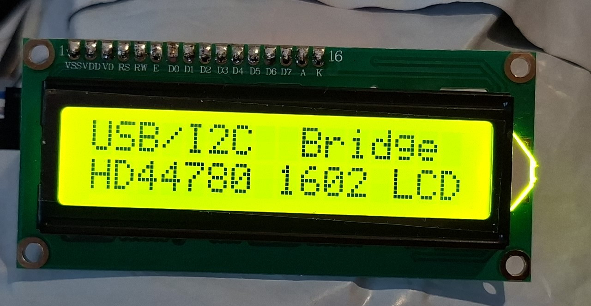

# Hardware examples

This is a companion repository for the scripts communicating through the Arduino Bridge: https://github.com/husteeri/usb-peripheral-bridge.

The primary drive behind this project was the ability to quickly test, debug, and even fully control these and similar hardware circuits directly from a PC.

All the examples included in this repository demonstrate the usage of the `Bridge` class, which handles communication using a simplified and reduced set of methods.

## Serial port devices

### 7941W RFID reader/writer board

This Python script serves as an implementation example for the serial devices,
demonstrating how to route custom UART protocol frames through the USB
Peripheral Bridge. It illustrates hardware serial configuration and atomic
serial_write/serial_read transactions, providing a template for handling
binary framing, payloads, and checksum validation.

The script can be directly used to copy RFID tags interactively from the PC.

Wiring the module to the Arduino should be as below:

Red - VCC : 5V

White - RxD : TX1 (18)

Green - TxD : RX1 (19)

Black - GND : GND

## I2C port devices

### SH1106 OLED board

The script prints and refreshes the screen with the actual local time, 
as it is on the PC.

This board has an onboard regulator, can be supplied with either 5V or 3.3V.

### DS3231 RTC board with 24C32 EEPROM

The script reads the time inside the RTC module and provides the option to
update it with the system time on the PC. 

These modules can achieve unbelievable accuracy with proper adjustment of 
setting the Aging/offset register value. My module stays within +/- 1 seconds in a 
year with the Aging register value set to 0x13.

There is also a script provided for reading and writing the onboard EEPROM chip.

This board can be supplied with voltage 2.3V to 5.5V.

### HD44780 based 16x02 character LCD with I2C adapter

This script initializes the HD44780 1602 LCD module over the I2C bus via the USB Peripheral Bridge and writes text to the display.

The PCF8574 I/O expander chip handles the I2C interface by controlling the display in 4-bit mode alongside the Enable, Register Select, and Backlight pins. You can adjust the contrast of the screen using the small blue potentiometer on the back of the I2C adapter board if the characters appear faint or blocked.

The script relies on the low-level I2C protocol specification, sending raw byte commands to control the display sequence reliably from a PC.

This LCD module can be powered with voltages ranging from 3.3V to 5.0V depending on your system setup.

## SPI port devices

Currently no device has been tested as I do not have access to any.

Planned tests:

- Miniature SPI bus touch panel displays

- RC522 RFID scanner

